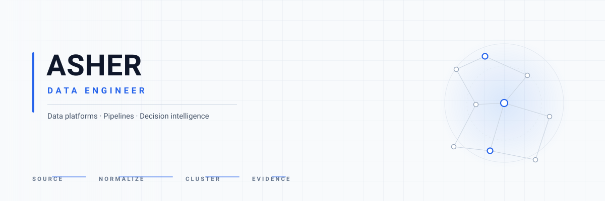

<h1 align="left">Delebayo Asher</h1>

  

**Data engineer. I build pipelines that turn messy public and operational data into decision-ready systems.**

Most of my work follows the same shape: find a source nobody has made usable, ingest it honestly, normalise it without destroying the originals, model it so the grain is defensible, and expose what is actually known — and what is not. Agricultural and environmental engineering background, applied to energy, infrastructure and public-sector data.

---

## Selected work

### Ordaciti — public decision intelligence
 

Turns Kaduna State government procurement records into longitudinal project intelligence. The OCDS endpoints were undocumented and returned 500s, so the working access path was recovered from the portal's own JavaScript — and that finding is written up with the full arithmetic, including a correction of an earlier wrong conclusion.

`1,379 raw records → 610 distinct projects → 781 signals → 610 evidence objects`

Each project carries facts with source IDs, signals, explicit `unknowns`, and open questions. The LLM layer is interpretation only: schema-validated JSON, temperature 0.3, cached against a data-version hash, and the application works fully without it.

**Python · TypeScript · Next.js · pandas · rapidfuzz · hybrid similarity clustering**

### NYC Taxi Data Platform

A full-lifecycle data platform built on NYC taxi trip data, from local containers to a cloud warehouse with batch and streaming paths.

`CSV → PostgreSQL → BigQuery → dbt marts`, plus a PySpark batch layer and a Redpanda/Kafka → PyFlink streaming layer with event-time windows and upserting JDBC sinks.

**Kestra · dbt · BigQuery · PySpark · Redpanda · Flink · PostgreSQL · Docker · Terraform**

### Energy demand decision support *(private repository)*
Electricity demand analytics on hourly ENTSO-E Transparency Platform data for a European bidding zone, as a layered warehouse with a hard data-quality gate.

`17,524 validated hourly observations · 11 warehouse views · 6-stage orchestrated flow`

Ingestion is state-based and incremental; missing hours are surfaced rather than interpolated, and the pipeline fails if a DQ assertion fails. Forecasting and real-time ingestion are roadmap items, not built.

**Python · PostgreSQL · dbt · PySpark · BigQuery · Kestra · Terraform**

### 80seven — KCNA exam preparation *(private repository)*
Browser-based Kubernetes and cloud-native certification readiness product: a timed 200-question mock, per-domain drills and wrong-answer review, fed by a Python question-bank engine with exposure tracking and eligibility rules.

The interesting part is the integrity work. The answer key was moved out of `public/` into a server-only module, so a client import becomes a build failure rather than a convention. Attempts are server-authoritative with database-time lifecycle transitions, terminal states that are absorbing, and Row Level Security throughout.

**TypeScript · Next.js · PostgreSQL · Supabase Auth · RLS · node:test · Python**

---

## Technical capabilities

Built from shipped code, not aspirations:

| Area | Technologies and practices |
| --- | --- |
| **Languages** | Python, TypeScript, JavaScript, SQL, Bash |
| **Orchestration** | Kestra — flows, plugin tasks, DQ gates |
| **Warehouse** | dbt Core, PostgreSQL, BigQuery, dimensional marts |
| **Processing** | pandas, NumPy, PySpark, rapidfuzz |
| **Streaming** | Redpanda / Kafka, PyFlink — watermarks, windows, JDBC sinks |
| **Cloud & infra** | BigQuery, GCS, Terraform, Docker, Vercel, Supabase |
| **Application** | Next.js, React, Tailwind CSS, Vite, SCSS |
| **Data integrity** | Ingestion reconciliation, provenance per fact, non-destructive normalisation |
| **AI integration** | OpenAI-compatible APIs, schema-validated JSON, version-keyed caching, graceful degradation |

Deliberately not claimed: Airflow, Spark Streaming, vector databases, Kubernetes in production, and machine-learning model training. Where those appear they are course material or roadmap, not shipped work.

---

## Domains

Public procurement and government decision intelligence · Energy demand analytics and grid data · Cloud-native certification tooling · Applied agritech · Time-series warehouse design

---

## Connect

   

Private repositories are available on request.

---

the world is just a code away from the next meaningful innovation
